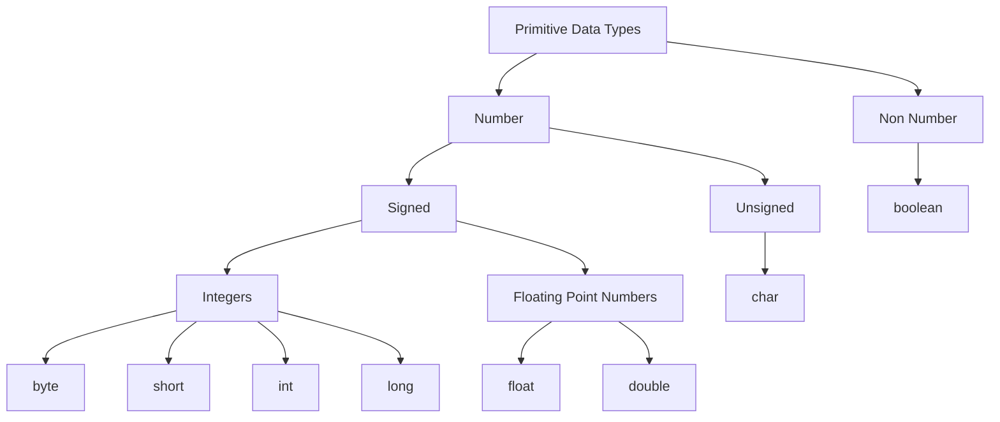

# Java Primitive Data Types

## Definition

Primitive data types in Java are the most **basic data types** that store simple values directly in memory, rather than references to objects.

Small, direct values like primitives are often used in:

- Loop counters (`int`), grade calculations (`float`, `double`)
- ASCII or Unicode character handling (`char`)
- On/off or feature toggles (`boolean`)
- Timestamp operations, distance traveled, age, percentages (`long`, `short`, `byte`, `double`)

| Type      | Size    | Range/Values                                                                        | Default Value      | Class Equivalent |
| --------- | ------- |-------------------------------------------------------------------------------------| ------------------ | ---------------- |
| `boolean` | N/A     | `false` or `true`                                                                   | `false`            | `Boolean`        |
| `char`    | 16 bits | `['\u0000', '\uFFFF']`  `[0, 65535]`                                          | all 0 binary value | `Char`           |
| `byte`    | 8 bits  |                                                                                     | `0`                | `Byte`           |
| `short`   | 16 bits | `[2^16, 2^16 - 1]`  `[65536, -65535]`                                         | `0`                | `Short`          |
| `ìnt`     | 32 bits | `[-2^31, +2^31 - 1]`  `[-2_147_483_648, -2_147_483_647]`                      | `0`                | `Integer`        |
| `long`    | 64 bits | `[2^63, 2^63 - 1]`  `[-9_223_372_036_854_775_808, 9_223_372_036_854_775_807]` | `0L`               | `Long`           |
| `float`   | 32 bits | TODO ;-)                                                                            | `0F`               | `Float`          |
| `double`  | 64 bits | TODO ;-)                                                                            | `0D`               | `Double`         |

## Lab

In this lab, we practice using primitive Java data types.